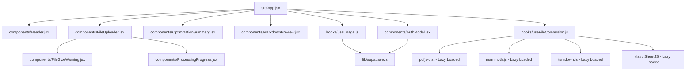

# Token Optimizer

<sub>Convert files to token-efficient markdown for LLM context</sub>

[](https://react.dev/)
[](https://vitejs.dev/)
[](https://tailwindcss.com/)
[](https://supabase.com/)

A modern, browser-based tool designed to convert PDFs, Word documents, spreadsheets, code, JSON, data structures, and images into clean, LLM-optimized markdown. **All conversion happens client-side in the browser** — ensuring 100% data privacy since your files never leave your machine.

---

## ⚡ Features

- **📄 Universal File Conversion** — Converts PDFs, `.docx`, `.xlsx`, HTML, JSON, CSV, vector/raster images, and plain text to Markdown.
- **🛡️ 100% Client-Side Processing** — No servers, no APIs, no third-party uploads. Your data remains secure on your device.
- **💸 Token & Size Optimization** — Strips binary bloat, metadata, and CSS styles, resulting in up to **90%+ size reduction** and significant savings on LLM prompt costs.
- **🔒 Tiered Access & Authentication** — 
  - **Guest Mode:** Perform up to `5` conversions with instant client-side local tracking.
  - **Supabase Integration:** Create a free account via passwordless **Email OTP** and secure password confirmation to unlock unlimited, forever-free conversions.
- **📊 Real-time Analytics** — Instantly estimates tokens, compares raw file size against output markdown size, and calculates exact reduction percentages.
- **👁️ Interactive Preview** — Toggle dynamically between rich rendered markdown style sheets and raw markdown source.
- **📋 Direct Actions** — One-click copy to clipboard or immediate download as a `.md` file.
- **⚠️ Safety Features** — Integrated file size warning systems to prevent browser-memory blockages during heavy conversion pipelines.
- **🌓 Adaptive Theme** — High-fidelity dark mode matching the aesthetic of modern LLM interfaces like Anthropic's Claude.

---

## 📂 Supported Formats

| Category | Supported Formats | Engine/Library |
| :--- | :--- | :--- |
| **Documents** | `PDF`, `DOCX`, `DOC`, `ODT`, `RTF` | `pdfjs-dist` & `mammoth` |
| **Spreadsheets** | `XLSX`, `XLS`, `CSV`, `TSV`, `ODS` | `SheetJS (xlsx)` |
| **Presentations** | `PPTX`, `PPT`, `ODP` | Native text parser |
| **Web & Markup** | `HTML`, `HTM`, `XHTML` | `Turndown` |
| **Data** | `JSON`, `XML`, `YAML`, `YML`, `TOML` | Native serializing formatters |
| **Images (OCR/Meta)** | `PNG`, `JPG`, `JPEG`, `GIF`, `SVG`, `WEBP`, `BMP`, `ICO` | Custom local file rendering |
| **Code** | `.js`, `.jsx`, `.ts`, `.tsx`, `.py`, `.rb`, `.java`, `.cpp`, `.go`, `.rs`, `.php`, `.sql`, etc. | Syntax-highlighted codeblocks |

---

## 🏗️ Architecture



### File Structure & Roles
- **[src/App.jsx](file:///C:/Users/Mohamed%20Ismail/Documents/Projects_German/Claude-Token-optimization/src/App.jsx)** — Root coordinator. Manages global states (theme, active files, visibility of modals) and ties state transitions between the conversion hooks and UI wrappers.
- **[src/hooks/useFileConversion.js](file:///C:/Users/Mohamed%20Ismail/Documents/Projects_German/Claude-Token-optimization/src/hooks/useFileConversion.js)** — The processing core. Uses **lazy dynamic imports** to load heavy libraries (like `pdfjs-dist` or `xlsx`) only when a user uploads that specific file type. Uses `AbortController` for clean conversion cancellations.
- **[src/hooks/useUsage.js](file:///C:/Users/Mohamed%20Ismail/Documents/Projects_German/Claude-Token-optimization/src/hooks/useUsage.js)** — Local storage usage tracker. Enforces the guest conversion threshold (up to 5) and bridges session state.
- **[src/components/AuthModal.jsx](file:///C:/Users/Mohamed%20Ismail/Documents/Projects_German/Claude-Token-optimization/src/components/AuthModal.jsx)** — Handles the Supabase auth state machine. Supports signup, standard OTP checks, multiple token verification triggers (`email`, `signup`, `magiclink`), new user password initialization, and secure credentials login.
- **[src/components/FileSizeWarning.jsx](file:///C:/Users/Mohamed%20Ismail/Documents/Projects_German/Claude-Token-optimization/src/components/FileSizeWarning.jsx)** — Visual alerts when files exceed target size limits to prevent browser crashes.
- **[src/components/ProcessingProgress.jsx](file:///C:/Users/Mohamed%20Ismail/Documents/Projects_German/Claude-Token-optimization/src/components/ProcessingProgress.jsx)** — Shows progress indicators for multi-phase operations.
- **[src/lib/supabase.js](file:///C:/Users/Mohamed%20Ismail/Documents/Projects_German/Claude-Token-optimization/src/lib/supabase.js)** — Connects to the Supabase backend utilizing env configurations.
- **[src/utils/fileUtils.js](file:///C:/Users/Mohamed%20Ismail/Documents/Projects_German/Claude-Token-optimization/src/utils/fileUtils.js)** — Utility helpers for parsing raw text, estimating Claude-friendly LLM token lengths, and formatting file sizes.

---

## 🚀 Getting Started

### 1. Prerequisites
- **Node.js** v18.0.0 or higher
- **npm** v9.0.0 or higher

### 2. Installation
```bash
# Clone the repository
git clone https://github.com/Mirza-Glitch/markitdown-js.git
cd Claude-Token-optimization

# Install dependencies
npm install
```

### 3. Environment Variables
Create a file named `.env` in the root folder of the project (copying the structure from [`.env.example`](file:///C:/Users/Mohamed%20Ismail/Documents/Projects_German/Claude-Token-optimization/.env.example)):
```env
VITE_SUPABASE_URL=https://your-supabase-url.supabase.co
VITE_SUPABASE_ANON_KEY=your-supabase-anon-key-here
```

### 4. Setup Custom SMTP / Resend in Supabase (Recommended)
To ensure reliable passwordless signups and OTP delivery:
1. Go to the **Supabase Dashboard** -> **Project Settings** -> **Auth** -> **Email Settings**.
2. Turn **Enable Custom SMTP** to **ON**.
3. Configure your SMTP provider (e.g., [Resend](https://resend.com/)):
   - **SMTP Host:** `smtp.resend.com`
   - **SMTP Port:** `465` or `587`
   - **SMTP Username:** `resend`
   - **SMTP Password:** *Your Resend API Key*
   - **Sender Email:** A verified domain sender email in Resend (e.g., `onboarding@yourdomain.com`).
4. Ensure the domain chosen matches the sender address perfectly to prevent empty auth errors.

### 5. Setup Google & GitHub OAuth in Supabase
The frontend buttons for Google and GitHub are already configured in [src/components/AuthModal.jsx](file:///C:/Users/Mohamed%20Ismail/Documents/Projects_German/Claude-Token-optimization/src/components/AuthModal.jsx) to trigger authentication client-side. To make them work:

#### Configuring GitHub OAuth:
1. Go to GitHub -> **Settings** -> **Developer Settings** -> **OAuth Apps** -> **Register a new application**.
2. Enter a homepage URL (e.g., `http://localhost:5173` for testing).
3. Set the **Authorization callback URL** using your Supabase project callback link (found in the Supabase Dashboard at **Auth** -> **Providers** -> **GitHub**):
   `https://<your-supabase-project-ref>.supabase.co/auth/v1/callback`
4. Register the app, generate a **Client Secret**, and copy both the **Client ID** and **Client Secret**.
5. Return to the **Supabase Dashboard** -> **Auth** -> **Providers** -> **GitHub**, enable the provider, paste your credentials, and save.

#### Configuring Google OAuth:
1. Go to the **Google Cloud Console** -> **APIs & Services** -> **Credentials** -> **Create Credentials** -> **OAuth client ID**.
2. Choose **Web application** as the Application type.
3. Add the callback URL under **Authorized redirect URIs** (retrieve it from **Auth** -> **Providers** -> **Google** in Supabase):
   `https://<your-supabase-project-ref>.supabase.co/auth/v1/callback`
4. Create the client ID, and copy the generated **Client ID** and **Client Secret**.
5. Return to the **Supabase Dashboard** -> **Auth** -> **Providers** -> **Google**, enable the provider, paste your credentials, and save.

#### Syncing Authenticated Users to Public Tables (Optional)
By default, Supabase stores authenticated OAuth users inside the system schema table `auth.users`. If you wish to mirror them automatically into a public database table (e.g., a `public.profiles` or `public.users` table for querying or usage records), execute this SQL inside the **Supabase SQL Editor**:

```sql
-- 1. Create a public profiles table
create table public.profiles (
  id uuid references auth.users on delete cascade primary key,
  email text,
  avatar_url text,
  full_name text,
  created_at timestamp with time zone default timezone('utc'::text, now()) not null
);

-- 2. Enable Row Level Security (RLS)
alter table public.profiles enable row level security;

-- 3. Create policies
create policy "Allow public read access" on public.profiles for select using (true);
create policy "Allow individual update" on public.profiles for update using (auth.uid() = id);

-- 4. Create trigger function to copy new users automatically
create or replace function public.handle_new_user()
returns trigger as $$
begin
  insert into public.profiles (id, email, avatar_url, full_name)
  values (
    new.id,
    new.email,
    new.raw_user_meta_data->>'avatar_url',
    coalesce(new.raw_user_meta_data->>'full_name', new.raw_user_meta_data->>'name')
  );
  return new;
end;
$$ language plpgsql security definer;

-- 5. Bind the trigger to auth.users table
create trigger on_auth_user_created
  after insert on auth.users
  for each row execute procedure public.handle_new_user();
```

### 6. Running the Application
```bash
# Launch the development server
npm run dev
```
Open [http://localhost:5173](http://localhost:5173) in your browser.

### 7. Building for Production
To bundle the optimized assets:
```bash
npm run build
```
Preview the production build locally:
```bash
npm run preview
```


---

## 💡 Why Optimize Tokens?

Large language models process text in units called **tokens**. Feeding raw, formatted files (like `.pdf` or `.docx`) into a chat window includes a massive volume of invisible XML metadata, styling markup, and binary overhead. 

Optimizing your context:
1. **Reduces API Billing:** Smaller prompt packages mean you pay less per API query.
2. **Preserves Context Limits:** Fit more actual information inside the context window.
3. **Enhances Reasoning Quality:** Eliminates distracting noise, letting the model focus solely on clean text structures.

---

## 📄 License

This project is for personal and educational use.
