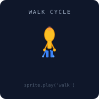
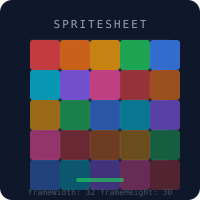
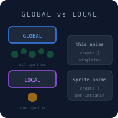
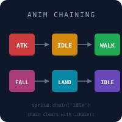
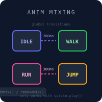
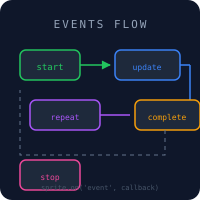
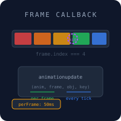
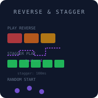

# Phaser 4 — Sprite Animations

<p align="center">
  
</p>

<p align="center">
  <b>AnimationManager</b> · <b>AnimationState</b> · Spritesheets · Atlases · Chaining · Events · Frame Callbacks
</p>

<p align="center">
  
  
  
</p>

<p align="center">
  
</p>

---

## ⚡ Quick Start

```js
this.load.spritesheet('explosion', 'explosion.png', { frameWidth: 64, frameHeight: 64 });

this.anims.create({
    key: 'explode',
    frames: this.anims.generateFrameNumbers('explosion', { start: 0, end: 11 }),
    frameRate: 24, repeat: 0
});

const sprite = this.add.sprite(400, 300, 'explosion');
sprite.play('explode');
```

---

## 🧠 Core Concepts

### AnimationManager vs AnimationState

| Aspect | AnimationManager | AnimationState |
|---|---|---|
| Access | `this.anims` | `sprite.anims` |
| Scope | Global — shared across scenes | Per-sprite instance |
| Purpose | Create / store definitions | Control playback |
| Class | `Phaser.Animations.AnimationManager` | `Phaser.Animations.AnimationState` |

<p align="center">
  
</p>

---

## 🎞️ Spritesheet & Atlas

### Spritesheet — `generateFrameNumbers`

```js
this.load.spritesheet('dude', 'dude.png', { frameWidth: 32, frameHeight: 48 });

this.anims.create({
    key: 'run',
    frames: this.anims.generateFrameNumbers('dude', { start: 0, end: 7 }),
    frameRate: 10, repeat: -1
});
```

<p align="center">
  
</p>

### Atlas — `generateFrameNames`

```js
this.load.atlas('gems', 'gems.png', 'gems.json');

this.anims.create({
    key: 'ruby_sparkle',
    frames: this.anims.generateFrameNames('gems', {
        prefix: 'ruby_', start: 1, end: 6, zeroPad: 4
    }),
    frameRate: 12, repeat: -1
});
```

---

## 🔄 Playback Control

### Yoyo, Repeat & Chaining

```js
this.anims.create({
    key: 'pulse', frames: 'orb', frameRate: 10,
    yoyo: true, repeat: -1, repeatDelay: 500
});

sprite.play('attack');
sprite.chain('idle');
sprite.chain(['fall', 'land', 'idle']);
```

<p align="center">
  
</p>

### Reverse, Pause, Stop

```js
sprite.playReverse('walk');
sprite.anims.reverse();

sprite.anims.pause();
sprite.anims.resume();
this.anims.pauseAll();

sprite.anims.stop();
sprite.anims.stopAfterDelay(2000);
sprite.anims.stopOnFrame(frame);
```

---

## 🎛️ Playback Variants & Mixing

```js
sprite.play('walk', true);                        // ignoreIfPlaying
sprite.anims.playAfterDelay('walk', 1000);       // delayed
sprite.anims.playAfterRepeat('walk', 2);         // after repeats

this.anims.addMix('idle', 'walk', 200);          // transition delay
sprite.play('idle'); sprite.play('walk');        // 200ms mix
```

<p align="center">
  
</p>

---

## 📡 Events & Frame Callbacks

```js
sprite.on('animationcomplete', (anim, frame, gameObject, frameKey) => {
    console.log('completed:', anim.key);
});

sprite.on('animationcomplete-explode', (anim, frame, gameObject, frameKey) => {
    gameObject.destroy();
});
```

Available events: `animationstart`, `animationcomplete`, `animationcomplete-{key}`, `animationupdate`, `animationstop`, `animationrepeat`, `animationrestart`.

### Frame-Level Callbacks

```js
sprite.on('animationupdate', (anim, frame, gameObject, frameKey) => {
    if (anim.key === 'attack' && frame.index === 4) {
        this.checkHit(gameObject);
    }
});
```

<p align="center">
  
</p>

<p align="center">
  
</p>

---

## ✨ Visual Effects

### Per-Frame Duration

```js
this.anims.create({
    key: 'combo',
    frames: [
        { key: 'fighter', frame: 'punch1', duration: 50 },
        { key: 'fighter', frame: 'kick',   duration: 200 },
        { key: 'fighter', frame: 'recover', duration: 100 }
    ], frameRate: 24
});
```

### Visibility, Random Start & TimeScale

```js
this.anims.create({
    key: 'appear', frames: 'sparkle', frameRate: 12,
    showOnStart: true, hideOnComplete: true, showBeforeDelay: true
});

this.anims.create({
    key: 'ambient', frames: 'fire', frameRate: 10, repeat: -1,
    randomFrame: true
});

sprite.anims.timeScale = 2;
sprite.play({ key: 'walk', timeScale: 0.5 });
this.anims.globalTimeScale = 0.5;
```

### Staggered Playback

```js
const enemies = this.add.group({ key: 'enemy', repeat: 9 });
this.anims.staggerPlay('walk', enemies.getChildren(), 100);
```

<p align="center">
  
</p>

---

## 📋 Configuration Reference

### AnimationConfig

| Property | Type | Default | Description |
|---|---|---|---|
| `key` | string | — | Unique identifier |
| `frames` | string or AnimationFrame[] | `[]` | Texture key or frame configs |
| `frameRate` | number | `24` | Frames per second |
| `duration` | number | `null` | Total ms (derives frameRate) |
| `repeat` | number | `0` | Repeat count (-1 infinite) |
| `repeatDelay` | number | `0` | Delay between repeats (ms) |
| `yoyo` | boolean | `false` | Play backward then forward |
| `delay` | number | `0` | Delay before playback (ms) |
| `showOnStart` | boolean | `false` | Set visible on start |
| `hideOnComplete` | boolean | `false` | Set invisible on complete |
| `randomFrame` | boolean | `false` | Start from random frame |
| `skipMissedFrames` | boolean | `true` | Skip frames when lagging |

### Priority: `duration` vs `frameRate`

- Both null → defaults to 24 fps
- Only `duration` set → frameRate calculated from it
- `frameRate` set → **frameRate wins**, duration derived

### PlayAnimationConfig

| Property | Type | Default | Description |
|---|---|---|---|
| `key` | string or Animation | — | Animation key or instance |
| `startFrame` | number | `0` | Frame index to start from |
| `timeScale` | number | `1` | Speed multiplier |

---

## 🔧 Aseprite Support

```js
this.load.aseprite('paladin', 'paladin.png', 'paladin.json');
this.anims.createFromAseprite('paladin');               // all tags
this.anims.createFromAseprite('paladin', ['walk']);     // specific tags
sprite.play('walk');
```

---

## 🔀 JSON Export / Import

```js
const data = this.anims.toJSON();
this.anims.fromJSON(data);
this.anims.fromJSON(data, true);   // clear existing

if (!this.anims.exists('walk')) {
    this.anims.create({ key: 'walk', frames: 'player_walk', frameRate: 12, repeat: -1 });
}
```

---

## 🔌 Runtime Frame Modification

```js
const anim = this.anims.get('walk');
anim.addFrame(this.anims.generateFrameNumbers('player', { start: 8, end: 10 }));
anim.addFrameAt(frames, 2);
anim.removeFrame(frame);
anim.removeFrameAt(0);
```

---

## 📡 Event Flow

1. `animationstart` — delay expired, before first update
2. `animationupdate` — each frame change
3. `animationrepeat` — each repeat cycle
4. `animationcomplete` — natural end (finite repeat)
5. `animationcomplete-{key}` — same, with key appended

Stopped manually → `animationstop`. Restarted mid-play → `animationrestart`.

All callbacks: `(animation, frame, gameObject, frameKey)`.

---

## ⚠️ Gotchas

1. **Animations are global by default** — `this.anims.create()` across all Scenes; recreating logs a warning
2. **`repeat: -1` never fires `animationcomplete`** — use `stop()`, listen for `animationstop`
3. **`frameRate` beats `duration`** — set only `duration` (leave frameRate null) for total length
4. **Per-frame `duration` is additive** — added to base msPerFrame, not a replacement
5. **`play()` stops current** — use `play(key, true)` to skip if already playing
6. **Mix delays only with `play()`** — `playAfterDelay`/`playAfterRepeat` bypass mixes
7. **Local overrides global** — same key on sprite's local map takes priority
8. **Sprite shorthand** — `sprite.play()`, `sprite.playReverse()`, `sprite.chain()`, `sprite.stop()` wrap `sprite.anims.*`
9. **Chained anims fire after stop** — clear queue with `sprite.anims.chain()` before stopping
10. **`generateFrameNumbers` end=-1 means last frame** — `__BASE` excluded automatically

---

## 🗺️ Source File Map

| File | Purpose |
|---|---|
| `src/animations/AnimationManager.js` | Global singleton — create, remove, get, generateFrame*, mix, staggerPlay |
| `src/animations/Animation.js` | Animation definition — frames, timing, yoyo, repeat |
| `src/animations/AnimationState.js` | Per-sprite component — play, stop, pause, chain, events |
| `src/animations/AnimationFrame.js` | Single frame data — textureKey, textureFrame, duration, progress |
| `src/animations/events/index.js` | All animation event constants |
| `src/animations/typedefs/Animation.js` | AnimationConfig typedef |
| `src/animations/typedefs/PlayAnimationConfig.js` | PlayAnimationConfig typedef |
| `src/animations/typedefs/GenerateFrameNumbers.js` | Config for generateFrameNumbers |
| `src/animations/typedefs/GenerateFrameNames.js` | Config for generateFrameNames |

---

## 🎬 Animated Preview

<div align="center">

| Global vs Local | Spritesheet | Playback |
|:---:|:---:|:---:|
|  |  |  |

</div>

<style>
@keyframes floatY {
  0%, 100% { transform: translateY(0); }
  50% { transform: translateY(-8px); }
}
@keyframes pulse {
  0%, 100% { opacity: 1; }
  50% { opacity: 0.6; }
}
@keyframes slideIn {
  from { opacity: 0; transform: translateY(20px); }
  to { opacity: 1; transform: translateY(0); }
}
@keyframes glow {
  0%, 100% { box-shadow: 0 0 8px rgba(34,197,94,0.3); }
  50% { box-shadow: 0 0 20px rgba(34,197,94,0.6); }
}
@keyframes rotate {
  from { transform: rotate(0deg); }
  to { transform: rotate(360deg); }
}
@keyframes shimmer {
  0% { background-position: -200% center; }
  100% { background-position: 200% center; }
}
img { transition: transform 0.3s ease; }
img:hover { transform: scale(1.05); }
@media (prefers-reduced-motion: reduce) {
  *, *::before, *::after { animation: none !important; transition: none !important; }
}
</style>