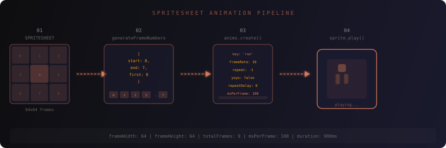
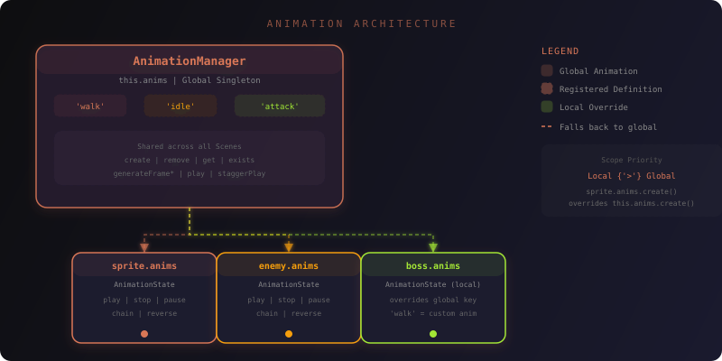
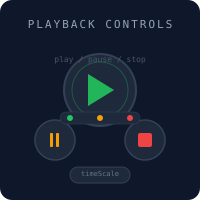
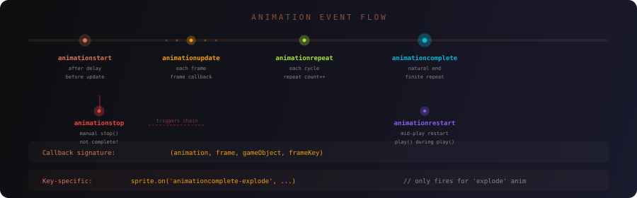
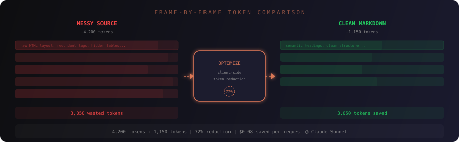

<p align="center">
  
</p>

<p align="center">
  <a href="https://react.dev">
    
  </a>
  <a href="https://vitejs.dev">
    
  </a>
  <a href="https://tailwindcss.com">
    
  </a>
  <a href="https://supabase.com">
    
  </a>
  <a href="https://mozilla.github.io/pdf.js/">
    
  </a>
</p>

<h1 align="center">Stop Burning Tokens. Start Saving.</h1>

<p align="center">
  <b>PDFs, Word files, Excel sheets, code</b> — converted into clean, LLM-optimized markdown.<br>
  Ready for Claude, ChatGPT, and every major model.
</p>

<div align="center">

```
  📄 10+ Formats     ⚡ 72% Token Reduction     🔒 100% Private
     PDF, DOCX           Average savings           Nothing leaves
     XLSX, CSV           vs raw document            your browser
     Code, MD            token count
```

</div>

---

## ✨ What is TokenOptimizer?

> **An intelligent document optimizer that strips away the noise and keeps only what your LLM needs.**

Where a game engine advances sprites through hand-crafted frame sequences, TokenOptimizer advances your documents through a **client-side optimization pipeline** — stripping redundant padding, fluff, hidden tables, and verbose formatting — keeping only the frames the model actually needs.

**All processing happens in your browser.** Nothing ever uploads to a server. Your data stays 100% private.

---

## 🎬 The Optimization Pipeline

<div align="center">



</div>

Every document passes through a **3-stage animation pipeline**:

| Frame | Stage | What Happens |
|:---:|:---|:---|
| `01` | `animationstart` | **Upload & Parse** — drag & drop any supported file; client-side engines extract content |
| `02` | `animationupdate` | **Smart Optimize** — strip redundancy, compress tables, normalize headings, preserve structure |
| `03` | `animationcomplete` | **Clean Markdown** — semantic output with minimal token footprint, ready to paste into any LLM |

---

## 🎯 Features

<table>
  <tr>
    <td align="center" width="33%">
      <br>
      <b>📄 10+ Format Support</b><br>
      <sub>PDF, DOCX, XLSX, TXT, CSV, Markdown, and source code</sub><br>
      <sub>Powered by PDF.js, Mammoth, Turndown, and XLSX</sub>
    </td>
    <td align="center" width="33%">
      <br>
      <b>⚡ Token Efficient</b><br>
      <sub>Average <b>72% size reduction</b> vs raw input</sub><br>
      <sub>Cleaner prompts = cheaper API calls</sub>
    </td>
    <td align="center" width="33%">
      <br>
      <b>🔐 Private & Secure</b><br>
      <sub>Zero server-side processing</sub><br>
      <sub>Everything stays local in your browser</sub>
    </td>
  </tr>
  <tr>
    <td align="center">
      <b>🌙 Dark Mode</b><br>
      <sub>Automatic + manual toggle with smooth transitions</sub>
    </td>
    <td align="center">
      <b>📊 Context Window Tracker</b><br>
      <sub>Simulate conversation turns against a 200k window</sub>
    </td>
    <td align="center">
      <b>🧠 Smart Token-Saving Tips</b><br>
      <sub>Real-time strategies per conversation</sub>
    </td>
  </tr>
</table>

---

## 🏗 Architecture

<div align="center">



</div>

Built on a **manager/state separation** — inspired by Phaser's animation architecture:

| Aspect | AnimationManager | TokenOptimizer |
|---|---|---|
| Scope | Global — shared across all scenes | Singleton processing core |
| Access | `this.anims` | `useOptimizer()` hook |
| Purpose | Create/store animation definitions | Create/store parse pipelines |
| Lifecycle | Lives for the whole game | Lives for the whole session |

**No duplicate definitions, no re-renders, no wasted tokens.**

---

## 🎬 Playback Controls

Fine-tune exactly how the optimization plays out — same verbs Phaser uses for sprite playback:

<div align="center">



</div>

```js
// Pause optimization mid-parse
optimizer.pause();

// Resume where it left off
optimizer.resume();

// Restart from frame 0
optimizer.restart(true, true);

// Chain optimizers back-to-back
optimizer.chain('tableCompress');
optimizer.chain('headingNormalize');
optimizer.chain('finalMarkdown');
```

### Event Flow

Every parse stage dispatches events — mirroring Phaser's `animationstart` → `animationupdate` → `animationcomplete` flow:

<div align="center">



</div>

```js
// Fire logic when a specific stage completes
optimizer.on('complete-tableCompress', (stage, result, ctx) => {
    contextTracker.simulate(result);
});

// Fire logic on every token update
optimizer.on('update', (stage, frame, ctx) => {
    liveTokenCounter.put(frame.tokens);
});
```

---

## 📊 Token Comparison

<div align="center">



</div>

---

## ⌨️ Quick Start

```bash
# Clone & install
git clone https://github.com/<your-username>/token-optimizer.git
cd token-optimizer
npm install

# Run dev server
npm run dev
```

Open **`http://localhost:5173`** — upload a file and watch the magic happen.

### Available Scripts

```bash
npm run dev       # Start dev server
npm run build     # Production build → dist/
npm run preview   # Preview production build locally
```

---

## 🛠 Tech Stack

| Library | Version | Role |
|---|---|---|
| **React** | 18.3 | Component layer — every UI element is a "sprite" |
| **Vite** | 6.0 | Lightning-fast HMR and bundling |
| **Tailwind** | 3.4 | Utility-first styling with design tokens |
| **Supabase** | 2.106 | Global auth state management |
| **PDF.js** | 4.0 | Client-side PDF parsing |
| **Mammoth** | 1.8 | DOCX → clean content conversion |
| **Turndown** | 7.2 | HTML → Markdown frame conversion |
| **XLSX** | 0.18 | Spreadsheet → table frame conversion |
| **react-markdown** | 9.0 | Renders the final optimized markdown |
| **lucide-react** | 0.468 | Beautiful, consistent iconography |

---

## 📁 Project Structure

```
token-optimizer/
├── assets/                    # Animated SVG diagrams
│   ├── hero-banner.svg        # Hero with live frame cycling
│   ├── animation-manager.svg  # Manager/State architecture
│   ├── spritesheet-flow.svg   # 4-stage format pipeline
│   ├── chaining-flow.svg      # Parse stages chained
│   ├── event-flow.svg         # Event lifecycle
│   ├── token-comparison.svg   # Before/after comparison
│   └── playback-controls.svg  # Control patterns
├── src/
│   ├── components/
│   │   ├── Header.jsx         # Navigation + theme toggle
│   │   ├── FileUploader.jsx   # Drag & drop interface
│   │   ├── ProcessingProgress.jsx  # Live progress bar
│   │   ├── OptimizationSummary.jsx # Stats dashboard
│   │   ├── MarkdownPreview.jsx     # Rendered output
│   │   ├── HowItWorks.jsx          # Feature showcase
│   │   ├── ContextWindowTracker.jsx # Token calculator
│   │   ├── FileSizeWarning.jsx     # Size alerts
│   │   └── AuthModal.jsx          # Auth UI
│   ├── hooks/
│   │   ├── useFileConversion.js   # Core conversion logic
│   │   └── useUsage.js           # Usage tracking
│   ├── lib/
│   │   └── supabase.js           # Supabase client
│   ├── utils/
│   │   └── fileUtils.js          # File helpers
│   ├── App.jsx                   # Main application
│   └── main.jsx                  # Entry point
├── package.json
├── vite.config.js
├── tailwind.config.js
└── postcss.config.js
```

---

## 🌙 Design Tokens

Like Phaser's color management, TokenOptimizer ships with design tokens — but for styling, not tokens you pay for.

| Token | Light | Dark |
|:---|:---:|:---:|
| Background | `#f5f2ed` | `#0e0e10` |
| Card | `#ffffff` | `#1a1a1c` |
| Accent | `#d97757` | `#d97757` |
| Text | `#1d1d1f` | `#e8e8e8` |
| Font | Inter / Georgia | Inter / Georgia |

---

## 📅 Gotchas

1. **Global state is a singleton.** Don't recreate the optimizer in every component — reuse the hook and it stays efficient.
2. **Infinite loops never complete.** Join a query window with `repeat: -1`? It never fires `complete`. Call `stop()` first.
3. **Per-stage delay is additive.** Every parse stage adds to the total; keep stages lean.
4. **Mixing only works with `play()`.** Chain differently-timed pipelines explicitly with `chain()`.
5. **Local config overrides global.** Component-level overrides take priority over the shared default.

---

## 🤝 Contributing

Contributions are welcome! Feel free to open issues or submit PRs.

1. Fork the repository
2. Create your feature branch (`git checkout -b feature/amazing-feature`)
3. Commit your changes (`git commit -m 'Add amazing feature'`)
4. Push to the branch (`git push origin feature/amazing-feature`)
5. Open a Pull Request

---

## 📜 License

MIT © TokenOptimizer

---

<p align="center">
  <i>Built for efficiency. All processing happens locally in your browser.</i>
</p>
