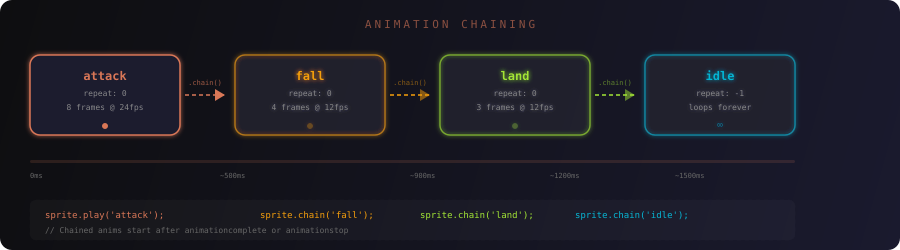

<p align="center">
  
</p>

<p align="center">
  <a href="https://react.dev">
    
  </a>
  <a href="https://vitejs.dev">
    
  </a>
  <a href="https://tailwindcss.com">
    
  </a>
  <a href="https://supabase.com">
    
  </a>
  <a href="https://mozilla.github.io/pdf.js/">
    
  </a>
</p>

<p align="center"><b>Turn any document into lean, LLM-ready markdown — frame by frame.</b></p>

---

## ✨ What is TokenOptimizer?

An **AnimationManager** for your text. Where Phaser advances sprites through hand-crafted frame sequences, TokenOptimizer advances your documents through a client-side optimization pipeline that strips redundant frames (padding, fluff, hidden tables) and keeps only the frames the model actually needs.

**PDFs, Word files, Excel sheets, code** — converted fully in-browser into clean, token-efficient markdown that Claude, ChatGPT, and every major model can consume at a fraction of the cost.

> 🔒 **100% private** — every frame is processed in your browser. Nothing ever uploads to a server.

<div align="center">

### The Optimization Pipeline

| Frame | Playback State | What Happens |
|:---:|:---:|:---|
| 01 | `animationstart` | **Upload & Parse** — drag & drop any supported file |
| 02 | `animationupdate` | **Smart Optimize** — strip redundancy, compress tables, preserve structure |
| 03 | `animationcomplete` | **Clean Markdown** — semantic output with minimal token footprint |

</div>

---

## ⚙️ Core Concepts

Just like Phaser's animation system, TokenOptimizer is built on a **manager/state** separation:

<p align="center">
  
</p>

| Aspect | AnimationManager | TokenOptimizer |
|---|---|---|
| Scope | Global — shared across all scenes | Singleton processing core |
| Access | `this.anims` | `useOptimizer()` hook |
| Purpose | Create/store animation definitions | Create/store parse pipelines |
| Lifecycle | Lives for the whole game | Lives for the whole session |

No duplicate definitions, no re-renders, no wasted tokens.

---

## 🎯 Features

<table>
  <tr>
    <td align="center" width="33%">
      
      <br><b>📄 10+ Formats</b><br>
      <sub>PDF, DOCX, XLSX, TXT, CSV, MD, source code</sub>
    </td>
    <td align="center" width="33%">
      
      <br><b>⚡ Token Efficient</b><br>
      <sub>Average <b>72% size reduction</b> vs raw input</sub>
    </td>
    <td align="center" width="33%">
      
      <br><b>🔐 Private & Secure</b><br>
      <sub>Zero server-side processing — everything stays local</sub>
    </td>
  </tr>
  <tr>
    <td align="center">
      <b>🌙 Dark Mode</b><br>
      <sub>Automatic + manual toggle with smooth transitions</sub>
    </td>
    <td align="center">
      <b>📊 Context Tracker</b><br>
      <sub>Simulate conversation turns against a 200k window</sub>
    </td>
    <td align="center">
      <b>🧠 Smart Tips</b><br>
      <sub>Real-time token-saving strategies per conversation</sub>
    </td>
  </tr>
</table>

---

## 🎬 Playback Controls

Fine-tune exactly how the optimization plays out — same verbs Phaser uses for sprite playback:

```js
// Pause optimization mid-parse
optimizer.pause();

// Resume where it left off
optimizer.resume();

// Restart from frame 0
optimizer.restart(true, true);

// Chain optimizers back-to-back
optimizer.chain('tableCompress');
optimizer.chain('headingNormalize');
optimizer.chain('finalMarkdown');
```

<p align="center">
  
</p>

### Event Flow

Every parse stage dispatches events — mirroring Phaser's `animationstart` → `animationupdate` → `animationcomplete` flow:

<p align="center">
  
</p>

```js
// Fire logic when a specific stage completes
optimizer.on('complete-tableCompress', (stage, result, ctx) => {
    contextTracker.simulate(result);
});

// Fire logic on every token update
optimizer.on('update', (stage, frame, ctx) => {
    liveTokenCounter.put(frame.tokens);
});
```

---

## ⌨️ Quick Start

```bash
# Clone & install
git clone https://github.com/<user>/token-optimizer.git
cd token-optimizer
npm install

# Run dev server
npm run dev
```

Open `http://localhost:5173` — upload a file and watch the magic happen.

---

## 🛠 Tech Stack

| Library | Version | Role |
|---|---|---|
| **React** | 18.3 | "Game Object" layer — every component is a sprite |
| **Vite** | 6.0 | Frame loader — instant HMR |
| **Tailwind** | 3.4 | Styling tokens, not document tokens |
| **Supabase** | 2.106 | `this.anims` analog — global auth state |
| **PDF.js** | 4.0 | Parses the PDF spritesheet |
| **Mammoth** | 1.8 | DOCX → markdown frames |
| **Turndown** | 7.2 | HTML → markdown frames |
| **XLSX** | 0.18 | Sheet → table frames |
| **react-markdown** | 9.0 | Renders the final frames |

---

## 🌙 Design Tokens

Like Phaser's color management, TokenOptimizer ships with design tokens — but for styling, not tokens you pay for.

| Token | Light | Dark |
|:---|:---:|:---:|
| Background | `#f5f2ed` | `#0e0e10` |
| Card | `#ffffff` | `#1a1a1c` |
| Accent | `#d97757` | `#d97757` |
| Text | `#1d1d1f` | `#e8e8e8` |
| Font | Inter / Georgia | Inter / Georgia |

---

## 📅 Gotchas

1. **Global state is a singleton.** Don't recreate the optimizer in every component — reuse the hook and it stays efficient.
2. **Infinite loops never complete.** Join a query window with `repeat: -1`? It never fires `complete`. Call `stop()` first.
3. **Per-stage delay is additive.** Every parse stage adds to the total; keep stages lean.
4. **Mixing only works with `play()`.** Chain differently-timed pipelines explicitly with `chain()`.
5. **Local config overrides global.** Component-level overrides take priority over the shared default.

---

## 🔧 Scripts

```bash
npm run dev       # Start dev server (http://localhost:5173)
npm run build     # Production build → dist/
npm run preview   # Preview production build locally
```

---

## 📂 Assets

Attractive animated SVG diagrams live in `assets/` — all are static files with embedded `<animate>` elements (no dependencies):

| File | Shows |
|---|---|
| `assets/hero-banner.svg` | Animated hero with live frame cycling + playback bar |
| `assets/animation-manager.svg` | Manager/State architecture with global→sprite fallback |
| `assets/spritesheet-flow.svg` | 4-stage format pipeline with progress bar |
| `assets/chaining-flow.svg` | Parse stages chained like sprite animations |
| `assets/event-flow.svg` | Event lifecycle with callback signature |
| `assets/token-comparison.svg` | Before/after token burn-down |
| `assets/playback-controls.svg` | Yoyo, pause/resume, timescale, stagger, reverse |

---

## 📜 License

MIT © TokenOptimizer